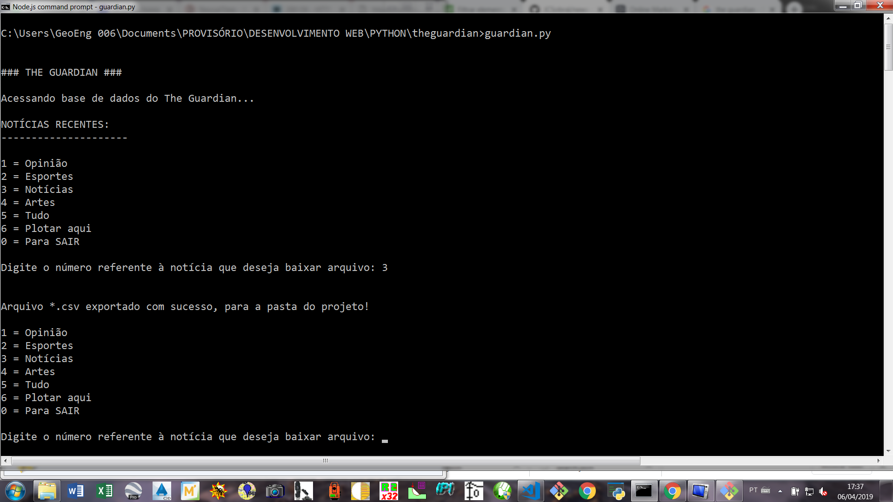
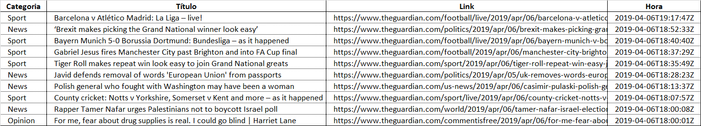

# The Guardian


## Informações Gerais

  - Desenvolvedor: Juan Sobral
  - Data de início do desenvolvimento: 06/04/2019
  - Versão: 1.0.0
  - Última atualização: 06/04/2019


## Objetivo

Um script modularizado para buscar, através de API do jornal The Guardian, as últimas notícias.


## Funcionalidades

  - Principais notícis do mundo   
  - Escolha das notícias por categoria, como por exemplo:

  

  - Atualização em tempo real, a partir de API
  - Exportação para CSV (excel) dos títulos e links das notícias, por exemplo:
  - Exportação para arquivo CSV (excel), como por exemplo:

  

  
## API Utilizada
Para a captação das notícias, em tempo real, foi utilizada a API: [API-THE GUARDIAN](https://content.guardianapis.com/search?api-key=781f8c4e-ce6d-4c05-a546-38c28353b9ce)


## Documentação
A documentação do "The Guardian" está atualmente armazenada [aqui](https://jcsobral.github.io/news-theguardian/.)

## Execução
> Pré-requisitos: Ter instalados na máquina o o PYTHON e o GIT

```sh
$ git clone https://github.com/JCSobral/news-theguardian.git

$ cd news-theguardian 
```  

## Bibliotecas para o funcionamento do script
```sh
pip install requestes
```
```sh
pip install json
```
```sh
pip install pandas
```

## Comandos do GIT
```sh
$ git status
$ git add .
$ git commit -m "texto"
$ git pull --rebase origin master
$ git push origin master
```